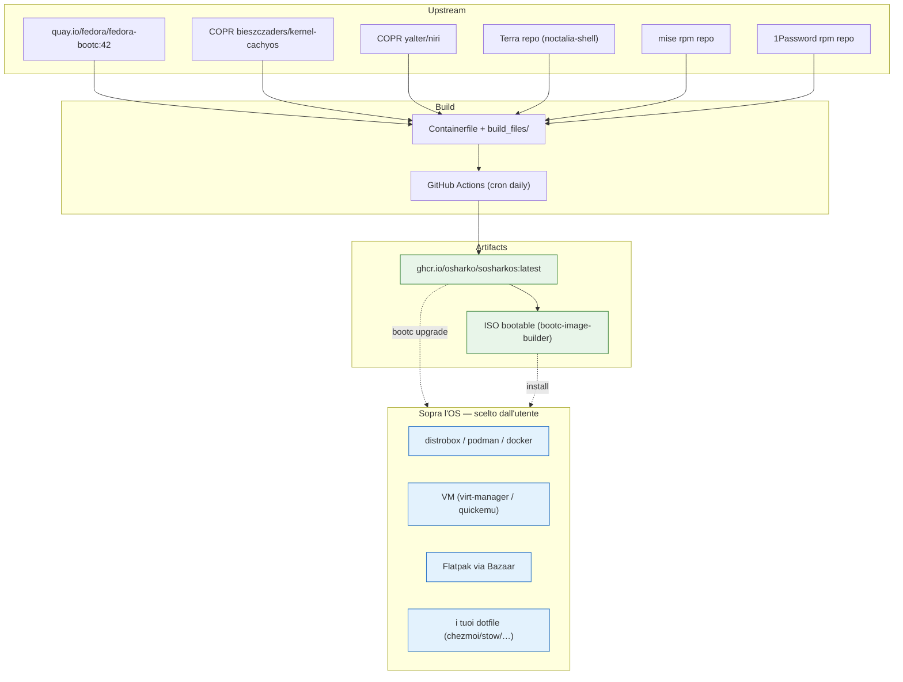
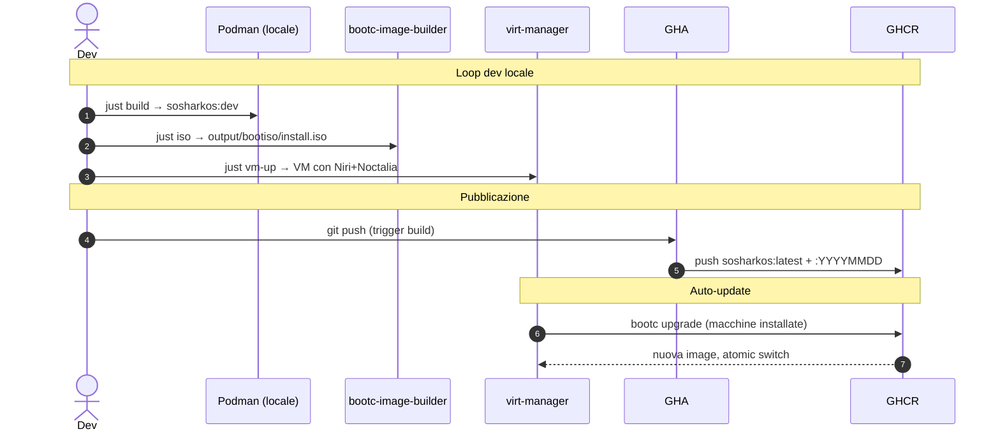

# SOsharkOS

Immagine **bootc immutabile** e **condivisibile**: un desktop Fedora pronto
all'uso con kernel performante e un buon set di strumenti per *installare ed
eseguire qualsiasi cosa* — senza mai ricostruire il sistema.

Base **Fedora bootc 42** + **kernel CachyOS** (COPR) + **Niri compositor** +
**Noctalia shell**.

## Filosofia: l'OS è un *launchpad*

Il sistema base è fisso, riproducibile e auto-aggiornato (`bootc upgrade`
atomico, rollback istantaneo). **Tutto l'app-specific vive SOPRA**, installato
dall'utente dopo il primo boot, senza toccare l'immagine:

| Vuoi… | Strumento già incluso |
|---|---|
| i tool di un'altra distro (apt, AUR, …) | **distrobox** (+ podman) |
| container / build OCI | **podman**, **docker** (moby), buildah, skopeo |
| una VM (qualsiasi OS) | **virt-manager** + **quickemu/quickget** + libvirt |
| Kubernetes | **kubectl** (helm/k9s/krew per-utente via mise) |
| runtime per-progetto (node/python/go/…) | **mise** |
| app GUI | **Flatpak** + **Bazaar** (store) + Flathub |
| password manager | **1Password** (nativo) · **Bitwarden** (Flatpak) |

Nessuna identità, segreto o dotfile personale è dentro l'immagine: chiunque la
installa fa il **proprio** login alle app e applica i **propri** dotfile/distrobox.

## Architettura



- L'OS è **bit-identico** tra macchine: cambia solo ciò che ci metti sopra.
- `bootc upgrade` aggiorna l'intero sistema atomicamente — rollback istantaneo.
- Niente drift: niente `pacman -Syu`/`dnf update` che accumula cruft nel tempo.
- I flatpak si installano al **primo boot** (`/var` non è nell'immagine), via
  `sosharkos-flatpak-setup.service` che legge `build_files/flatpaks.list`.

## Build pipeline (CI + dev locale)



**Comandi** (vedi `Justfile`):

```bash
just build      # OCI image locale (~10 min)
just iso        # ISO bootable (~5 min)
just vm-up      # avvia VM virt-manager con quella ISO
just cycle      # build + iso + vm-up
just clean      # rimuove image, ISO, VM
```

## Personalizzare *sopra* l'OS (dopo l'install)

```bash
# tool di un'altra distro senza sporcare l'host
distrobox create --name dev --image fedora:42 && distrobox enter dev

# runtime per-progetto (in una dir con .mise.toml o .tool-versions)
mise use node@22 python@3.13

# una VM al volo
quickget ubuntu 24.04 && quickemu --vm ubuntu-24.04.conf

# app GUI: apri Bazaar, oppure
flatpak install flathub <app-id>

# i tuoi dotfile: usa il gestore che preferisci (chezmoi, stow, yadm, …)
```

## Decisioni di design

- **Fedora bootc, non Arch** — bootc/rpm-ostree è il toolchain canonico per OCI
  bootable; su Arch non c'è ancora un equivalente maturo.
- **Kernel CachyOS da COPR** — scheduler + tuning desktop (BORE/sched-ext) da
  COPR upstream Fedora (bieszczaders), con merge regolari.
- **Niri + Noctalia** — il "carattere" di SOsharkOS. (Possibile in futuro una
  doppia ISO con un secondo desktop.)
- **Dev/cloud tool NON nell'OS** — cambiano spesso, generano drift. Stanno in
  distrobox/mise per-utente. L'immagine resta piccola e riproducibile.
- **App GUI via Flatpak/Bazaar** — installabili e aggiornabili senza rebuild,
  sandboxate. Solo le poche app meglio supportate native (1Password) nell'image.

## Roadmap

Vedi [ROADMAP.md](./ROADMAP.md).
